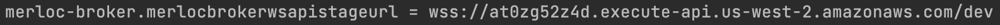

# MerLoc universal (runtime agnostic) GateKeeper


This project provides **universal** (runtime agnostic) `GateKeeper`component implementation based on AWS Lambda extension
to be able to use [MerLoc](https://github.com/thundra-io/merloc) as live AWS Lambda development tool.

> **Note** that, to be able to use MerLoc universal GateKeeper component,
> first you need to setup MerLoc platform into your AWS account
> as explained at MerLoc Github page [here](https://github.com/thundra-io/merloc).

## 1. Setup

- Add MerLoc GateKeeper layer
  
  ### Layer Setup for Node.js, Python, Java, .NET and Ruby Runtimes
  Add MerLoc GateKeeper layer: `arn:aws:lambda:${region}:269863060030:layer:merloc-gatekeeper:${version}`

  You can use the latest layer version (shown below) instead of the `${version}` above:

   (badge powered by [Globadge serverless](https://www.globadge.com/badges/serverless))

  Note that the region of the ARN is dynamic, so you need to change it accordingly to the region where you deploy your function.
  So let’s say that you deploy your Lambda function to the `Oregon` (`us-west-2`) region.
  So the layer ARN will be: `arn:aws:lambda:us-west-2:269863060030:layer:merloc-gatekeeper:${version}`

  ### Layer Setup for Go Runtime

  Add MerLoc GateKeeper Go layer: `arn:aws:lambda:${region}:269863060030:layer:merloc-gatekeeper-go:${version}`

  You can use the latest layer version (shown below) instead of the `${version}` above:

   (badge powered by [Globadge serverless](https://www.globadge.com/badges/serverless))

  Note that the region of the ARN is dynamic, so you need to change it accordingly to the region where you deploy your function.
  So let’s say that you deploy your Lambda function to the `Oregon` (`us-west-2`) region.
  So the layer ARN will be: `arn:aws:lambda:us-west-2:269863060030:layer:merloc-gatekeeper-go:${version}`


- Configure AWS Lambda Function

  ### Configure for Node.js, Python, Java, .NET and Ruby Runtimes
  Set `AWS_LAMBDA_EXEC_WRAPPER` environment variable to `/opt/extensions/merloc-gatekeeper-ext/bootstrap`

  ### Configure for Go Runtime
  Set runtime to `Custom runtime on Amazon Linux 2` (`provided.al2`)

> **Warning**
> **`Java 8 on Amazon Linux 1`** (`java8`) and **`.NET Core 3.1`** (`dotnetcore3.1`) runtimes are **not** supported.


- Set `MERLOC_BROKER_URL` environment variable to the
    - value of the `merloc-broker.merlocbrokerwsapistageurl` property which you get from AWS CDK broker setup output as shown in the example below:
      

    - **or** value of the `merlocbrokerwsapistageurl` property which you get from AWS CloudFormation broker setup output as shown in the example below:
      
      
    > **Note**  
    By default, Thundra hosted MerLoc broker is used (so the default value is `wss://merloc-broker.thundra.io`) 
    and it requires to sign-up Thundra APM [here](https://apm.thundra.io/), get your API key 
    and set your API key through `MERLOC_APIKEY` environment variable.

    
## 2. Configuration

- `MERLOC_BROKER_URL`: This configuration is **OPTIONAL**.
  You need to set this environment variable by broker URL
  as mentioned in the [GateKeeper Setup](#1-setup) section.
  The default value is `wss://merloc-broker.thundra.io` (Thundra hosted MerLoc broker).
  
- `MERLOC_APIKEY`: This configuration is **OPTIONAL**.
  But it is required (**MANDATORY**) if the broker requires API key (for example Thundra hosted MerLoc broker).
  If you are using Thundra hosted MerLoc broker (which is default), 
  you can sign-up Thundra APM [here](https://apm.thundra.io/) and get your API key. 

- `MERLOC_ENABLE`: This configuration is **OPTIONAL**.
  Even though MerLoc GateKeeper layer is added and configured,
  you can disable it by setting the `MERLOC_ENABLE` environment variable to `false`.
  For example,
  ```
  MERLOC_ENABLE=false
  ```

- `MERLOC_DEBUG_ENABLE`: This configuration is **OPTIONAL**.
  By default, internal debug logs are disabled,
  but you can enable it by setting the `MERLOC_DEBUG_ENABLE` environment variable to `true`.
  For example,
  ```
  MERLOC_DEBUG_ENABLE=true
  ```

- `MERLOC_BROKER_CONNECTION_NAME`: This configuration is **OPTIONAL**.
  By default, the name of the connection to the broker is the name of the AWS Lambda function for GateKeeper.
  But you can change it by setting the `MERLOC_BROKER_CONNECTION_NAME` environment variable.
  For example,
  ```
  MERLOC_BROKER_CONNECTION_NAME=serkan-connection
  ```

## 3. Limitations

- If the resources (AWS RDS, AWS OpenSearch/Elasticsearch, AWS ElastiCache, etc ...) you are accessing inside the function are deployed inside a VPC,
  your local needs to have access to resources in the VPC.
  So you need to setup a VPN connection from your local machine to the VPC network.
  You can check [this AWS blog post](https://aws.amazon.com/tr/blogs/networking-and-content-delivery/introducing-aws-client-vpn-to-securely-access-aws-and-on-premises-resources/)
  to learn how to do that.

## 4. Issues and Feedback

[](https://github.com/thundra-io/merloc-gatekeeper-aws-lambda-extension/issues?q=is%3Aopen+is%3Aissue)
[](https://github.com/thundra-io/merloc-gatekeeper-aws-lambda-extension/issues?q=is%3Aissue+is%3Aclosed)

Please use [GitHub Issues](https://github.com/thundra-io/merloc-gatekeeper-aws-lambda-extension/issues) for any bug report, feature request and support.

## 5. Contribution

[](https://github.com/thundra-io/merloc-gatekeeper-aws-lambda-extension/pulls?q=is%3Aopen+is%3Apr)
[](https://github.com/thundra-io/merloc-gatekeeper-aws-lambda-extension/pulls?q=is%3Apr+is%3Aclosed)
[]()

If you would like to contribute, please
- Fork the repository on GitHub and clone your fork.
- Create a branch for your changes and make your changes on it.
- Send a pull request by explaining clearly what is your contribution.

> Tip: 
> Please check the existing pull requests for similar contributions and 
> consider submit an issue to discuss the proposed feature before writing code.

## 6. License

Licensed under [Apache License 2.0](LICENSE).
